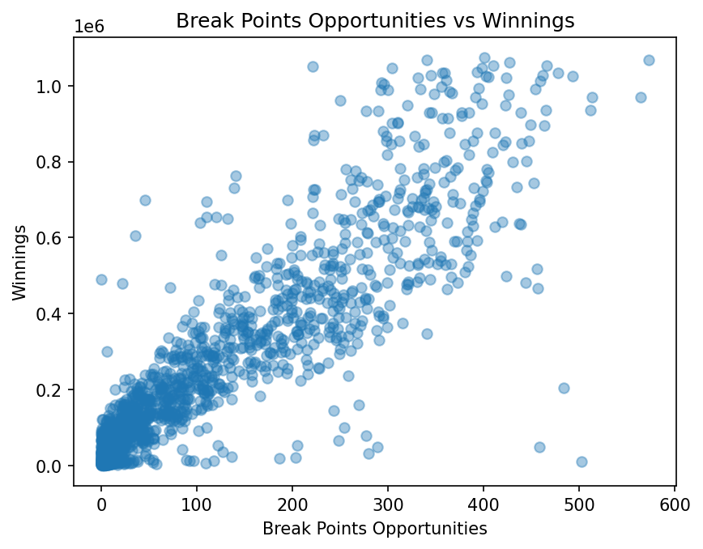
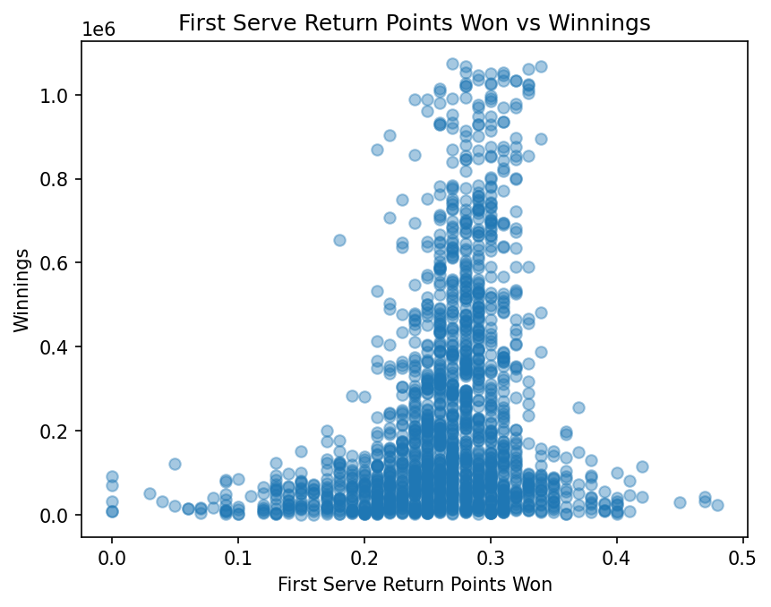
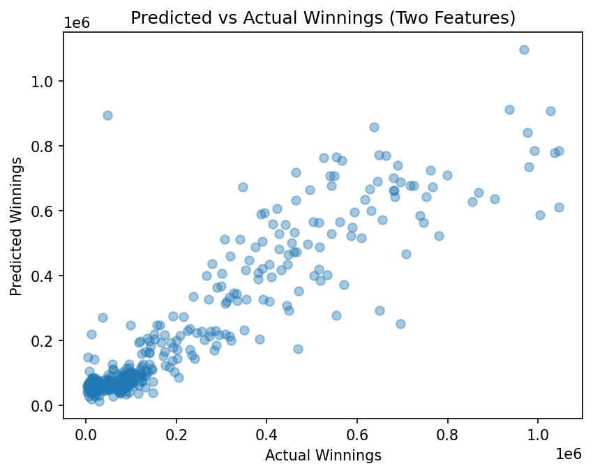

# Tennis Winnings Predictor

Projeto desenvolvido durante curso na plataforma Codecademy.

## Descrição
Análise de dados de desempenho no tênis profissional para entender
como métricas esportivas influenciam os ganhos financeiros dos atletas.

## O que foi feito
- Análise de dados com Python e Pandas
- Regressão linear simples e múltipla
- Visualização de dados com Matplotlib
- Avaliação do modelo usando R²

## Tecnologias
- Python
- Pandas
- Matplotlib
- Scikit-learn

Projeto com fins educacionais.

## 📊 Visualizações Geradas

Os gráficos abaixo demonstram a relação entre métricas de desempenho esportivo
e os ganhos financeiros dos atletas, além da evolução dos modelos de regressão.

### Oportunidades de Break Points vs Ganhos

### Pontos ganhos no retorno do primeiro saque vs Ganhos

### Previsões vs Ganhos Reais (Recurso Único)

### Previsões vs Ganhos Reais (Duas Características)

### Previsões vs Ganhos Reais (Múltiplas Características)

